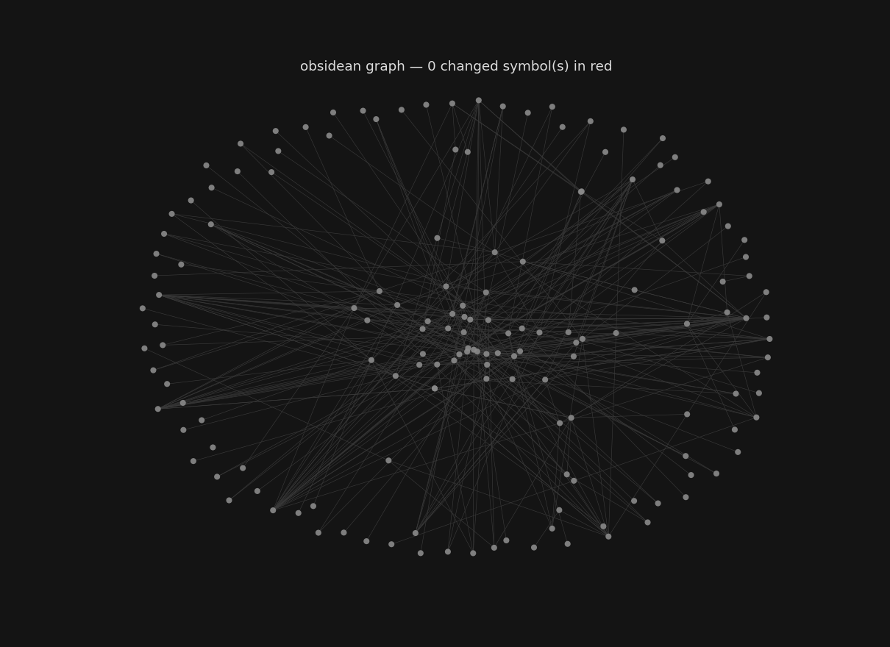

# repo2obsidean

[](https://pypi.org/project/repo2obsidean/)
[](https://pypi.org/project/repo2obsidean/)
[](LICENSE)

Transform code repositories into Obsidian vaults — one markdown note per class and method, with wikilinks connecting callers, callees, and inheritance relationships.

**On PyPI:** <https://pypi.org/project/repo2obsidean/> — `pip install repo2obsidean`

Everyone is welcome to contribute to this repository and build a crazy open source package.

## Why?

- **Token efficiency**: Instead of reading a whole repository file (20k tokens), agents fetch just the relevant symbol's note (200–500 tokens). Per-symbol notes are individually addressable, unlike a repomix bundle.
- **Human navigation**: Obsidian's backlinks and graph view turn code into a browseable knowledge graph.
- **Language-agnostic**: Tree-sitter + static analysis scales to any language (Python, Go, JS, Java, …) by adding a `.scm` query file.

## Installation

Installs the `repo2obsidean` command (with `obsidean` as a short alias). Pick
whichever fits:

```bash
# From PyPI (once published) — no repo needed:
pip install repo2obsidean
# or as an isolated global CLI tool, like running `repomix`:
pipx install repo2obsidean

# Directly from GitHub (works today, no PyPI needed):
pip install "git+https://github.com/martinvelezf/repo2obsidean.git"

# From a built wheel (offline):
pipx install dist/repo2obsidean-0.1.1-py3-none-any.whl

# From source, editable, for development:
python3 -m venv venv && source venv/bin/activate
pip install -e ".[dev]"
```

To build the distributables yourself: `python -m build` writes a wheel **and**
sdist to `dist/`.

## Quick Start

Run it in a repository directory with no arguments — just like `repomix`:

```bash
cd /path/to/your/repo
obsidean                       # auto-detects .py/.go, writes ./obsidean-vault
```

Or point it explicitly:

```bash
obsidean /path/to/repo --out ./my-vault          # explicit path + output
obsidean /path/to/repo -l python -l javascript   # limit languages
```

### Multiple source roots (layers)

Point Obsidean at several trees at once. Each root is labelled by its folder
name (its "layer") so identically-named classes don't collide, and cross-tree
relationships are linked:

```bash
obsidean ./odoo ./user ./enterprise --out ./vault
```

Supported languages (auto-detected): **Python** (`.py`), **Go** (`.go`),
**JavaScript** (`.js`, `.mjs`, `.cjs`, `.jsx`). Add a language by writing a
tree-sitter walker in [tree_sitter_parser.py](repo2obsidean/parser/tree_sitter_parser.py)
and a glob in [cli.py](repo2obsidean/cli.py).

### Choosing directories and files

Give explicit layer names, and filter with include/exclude globs (repeatable):

```bash
# Name the layers explicitly instead of using the folder name
obsidean --layer odoo=./odoo --layer custom=./addons --out ./vault

# Only scan model files; skip tests and migrations
obsidean . --include 'models/**' --exclude 'tests/**' --exclude '**/migrations/**'
```

Globs match against both the path relative to the root and the bare filename.
Common build/vendor dirs (`node_modules`, `.git`, `venv`, `dist`, …) are always
skipped.

### Git change tracking (review what changed)

By default Obsidean compares each file to **git HEAD** and flags uncommitted
working-tree changes (staged + unstaged + new untracked files). Each affected
symbol note gets:

- a `#changed` tag **both** in frontmatter (`tags: [..., changed]`) and as an
  inline tag in the note body — so Obsidian recognises it everywhere,
- `changed: true` / `change_status: M|A|D` frontmatter (for Dataview/CSS),
- an inline `> [!warning]` callout with a **diff of just that symbol's lines**.

It also writes `Notes/recent-changes.md` — an index of every changed symbol,
grouped by layer and file, with links. A symbol is flagged only when a diff hunk
actually overlaps its line range (zero-context diffing), so unchanged neighbours
aren't marked. Disable with `--no-git`.

> A symbol is flagged only for changes to files **git already tracks** — brand
> new files only count once they are `git add`-ed (an untracked file hidden by
> `.gitignore` will not be detected).

#### Seeing changes in Obsidian's Graph view

Changed symbols light up in the graph once you add a colour group keyed on the
`#changed` tag:

1. Open **Graph view** → **Filters → Groups → New group**.
2. Query: `tag:#changed` — pick a bright colour (e.g. red).
3. Reload Obsidian after regenerating (`Ctrl/Cmd+P → "Reload app without
   saving"`) so it re-reads the freshly tagged notes.



The red nodes are exactly the symbols whose source changed since `HEAD` — a
live, navigable change-impact view of the codebase. Tip: add a second group like
`path:rebound` (blue) to tint a specific layer, and drag the node-size slider up
so changed nodes stand out.

That animation is generated straight from the symbol graph (no screen
recording) and can be regenerated any time:

```bash
python scripts/animate_graph.py repo2obsidean --out docs/graph-changed.gif
```

It rebuilds the graph, flags git-changed symbols, and writes a looping GIF where
the changed nodes pulse red — handy for PRs or change reviews outside Obsidian.

> Regenerating **preserves your `.obsidian/` config** (graph groups, workspace),
> so the colour group you set up survives every rebuild. Only the `Notes/`
> content is rewritten.

### Framework awareness: Odoo model inheritance

Odoo models relate through `_name` / `_inherit` / `_inherits` class attributes,
**not** Python base classes. Obsidean extracts these and links a model's base
definition to every extension across all scanned layers. The vault includes
`Notes/odoo-models.md` — a report that, per model, lists where it's **defined**
and **extended**, and flags any `_inherit` target that has **no base
definition** in the scanned roots (a likely missing addon tree). This is the
"are the inherited models wired up correctly?" check. It's inert for non-Odoo
codebases (no `_name`/`_inherit` ⇒ empty report).

Then open the result in Obsidian: **File → Open folder as vault →** select the
output directory.

## Output Structure

```
my-vault/
├── Notes/
│   ├── python/
│   │   ├── mymodule/
│   │   │   ├── MyClass.md
│   │   │   ├── MyClass__init.md
│   │   │   ├── MyClass__method.md
│   │   │   └── standalone_function.md
│   │   └── MOC-python.md
│   ├── index.md
└── .obsidian/              # (generated by Obsidian)
```

Each note includes:
- **Signature** — function/method signature
- **Docstring** — extracted documentation
- **Source** — collapsible snippet
- **Calls** — `[[wikilinks]]` to callees
- **Called by** — backlinks from callers
- **Related** — nearby symbols in the graph

## Roadmap

### MVP (Week 1) ✓
- `obsidean build` CLI: parse Python, emit per-class/method notes with wikilinks
- Local filesystem output
- Same-module call resolution

### Phase 2 (Week 2)
- REST API: `POST /jobs`, `GET /jobs/{id}`, async job execution
- Redis-backed job queue
- Zip download support

### Phase 3 (Week 3)
- Go support via tree-sitter
- S3/MinIO storage backend
- Webhook callbacks with HMAC signatures
- API key authentication

### Phase 4 (Week 4)
- Cross-module/cross-language call resolution
- MOC (Map of Content) generation
- `search.json` sidecar for embedded search

## Development

### Run tests

```bash
uv run pytest tests/unit -v
```

### Run integration test

```bash
# Parse a real repository
repo2obsidean /path/to/requests --out /tmp/requests-vault

# Open the vault in Obsidian Desktop and verify:
# - Session.md exists
# - Session__send.md exists and contains [[Session]]
# - Backlinks panel shows cross-references
```

### Add a new language

1. Write a tree-sitter query file: `repo2obsidean/parser/queries/{lang}.scm`
2. Add language to `Language` enum in `repo2obsidean/parser/base.py`
3. Add extraction logic to `TreeSitterParser._extract_{lang}_symbols()` and `_walk_{lang}_tree()`
4. Create test fixture: `tests/fixtures/sample_{lang}.{ext}`

## Architecture

- **Parser**: `repo2obsidean/parser/tree_sitter_parser.py` — uses tree-sitter to extract symbols
- **Graph**: `repo2obsidean/graph/builder.py` — networkx graph with typed edges (CALLS, INHERITS, IMPORTS)
- **Generator**: `repo2obsidean/generator/vault.py` — emits markdown files from graph + Jinja2 templates
- **CLI**: `repo2obsidean/cli.py` — orchestrates parsing → graph building → generation
- **API** (Phase 2): `repo2obsidean/api/` — FastAPI service wrapping the core engine

## Publishing to PyPI

`pip install repo2obsidean` works by name only once the package is published to
[PyPI](https://pypi.org). One-time setup, then a 3-step release:

```bash
# 0. one-time: create a PyPI account + an API token (pypi.org → Account → API tokens)
pip install build twine

# 1. build wheel + sdist
python -m build

# 2. (recommended) dry-run on TestPyPI first
twine upload --repository testpypi dist/*
pip install -i https://test.pypi.org/simple/ repo2obsidean

# 3. publish to the real PyPI
twine upload dist/*          # username: __token__   password: pypi-<your-token>
```

After step 3, anyone can `pip install repo2obsidean`. Notes:

- The name **`repo2obsidean`** must be free — check
  <https://pypi.org/project/repo2obsidean/> (a 404 means it's available).
- A version number can't be re-uploaded; bump `version` in `pyproject.toml` for
  each release.
- Until then, it installs directly from GitHub:
  `pip install "git+https://github.com/martinvelezf/repo2obsidean.git"`.

## License

MIT

